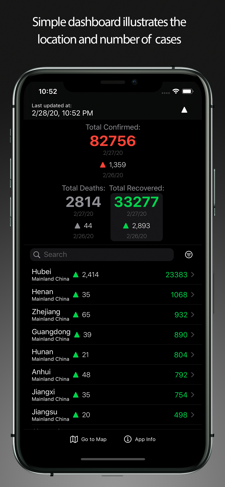
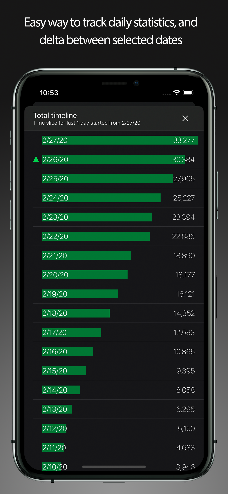
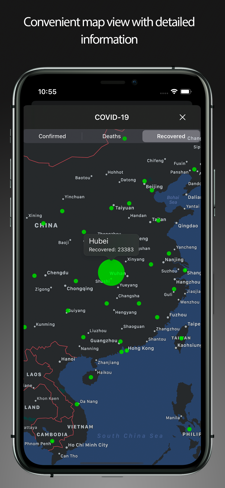

# [CvSOTracker](https://ihartsimafeichyk.github.io/CvSOTracker/)  

Simple application to track location and number of confirmed cases, deaths and recoveries for all affected countries. Application is based on open data from the Center for Systems Science and Engineering (CSSE) at Johns Hopkins University and DXY. 

Data currently available on the following zoom levels: City level - US, Canada and Australia; Province level - China; Country level - other countries.

It was developed to provide researchers, public health authorities and the general public with a user-friendly tool to track the outbreak as it unfolds.
